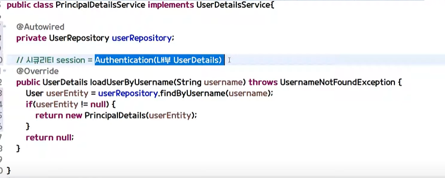

- loadByUsername

    loginProcessingUrl로 로그인 요청이 들어올때 
    자동으로 UserDetailsService 타입의
    loadUserByUsername 함수가 실행된다!

    **loadUserByUsername 파라미터를 잘 적어줘야한다!!**

    아니면 usernameParameter로 config에서 바꿔야한다...

