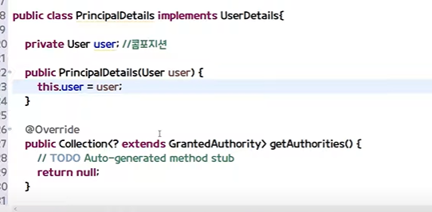

시큐리티가 로그인 주소로 로그인을 진행시키는데
로그인 진행이 완료가 되고 세션에 만드는데
시큐리티의 특이한 세션을 만든다.

security contextholder라는 키값에 저장

- 세션에 들어갈 수있는 오브젝트가 정해져있는데
authentication타입의 객체만 들어갈수있다
- authentication 안에는 user정보가 있을텐데 이 유저정보의 타입은
userdetails 타입 객체여야한다!
- 따라서 세션에서 꺼내쓸때 authentication 
객체에서 꺼내쓸수있다

따라서 userdetails를 implements해서 사용해야한다.

- getAuthorities
유저의 권한 리턴 

- getPassword

- isenabled
휴먼계정 등에 사용할 때

