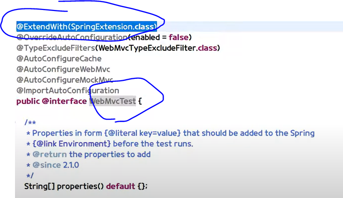
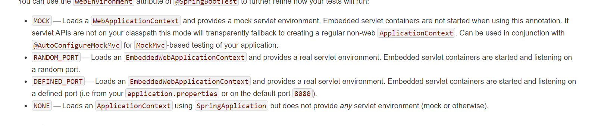
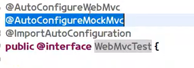
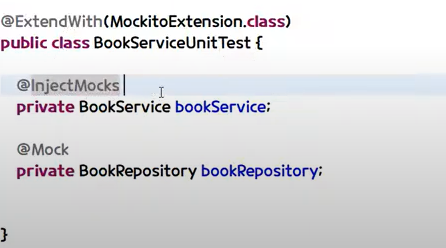
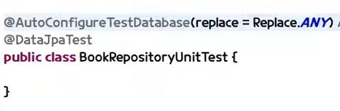
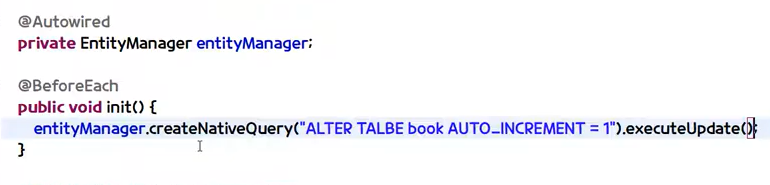

#### @RunWith(SpringRunner.class)
*Junit4의 경우*
실행환경을 스프링으로 확장시키기 위해서는 저 어노테이션을 꼭
붙여줘야함


*Junit5의 경우*
@WebMvcTest 안에 @ExtendWith(SpringRunner.class)이 있어서 저 어노테이션을 안붙여줘도 됨




#### @SpringBootTest(webEnvironment=WebEnvironment.MOCK/RANDOM_PORT)

*webEnvironment=WebEnvironment.MOCK*
실제 톰캣이 아닌 다른 톰캣으로 테스트

*webEnvironment=WebEnvironment.RANDOM_PORT*
실제 톰캣으로 테스트 하는데 다른 포트로

[@SpringBootTest](https://howtodoinjava.com/spring-boot2/testing/springboottest-annotation/)

[공식문서](https://docs.spring.io/spring-boot/docs/1.5.2.RELEASE/reference/html/boot-features-testing.html)
이 문서들 참조하면 도움됨




#### @AutoConfigureMockMvc
- MockMvc를 IoC에 주입해주는 것
*Junit5의 경우*
@WebMvcTest 안에 @AutoConfigureMockMvc이 있어서 저 어노테이션을 안붙여줘도 됨

만약에 @WebMvcTest 안에 없으면 당연히 MockMvc를 빈에 주입해서 써야함.





#### @Transactional
class 위에 붙여서 사용
- org.springframework 거임
##### 각각의 테스트 메소드에서 트랜잭션을 rollback해준다!


#### @ExtendWith(SpringExtension.class/MockitoExtension / 등등)
*단위테스트 할시에*

mockito에서

Service에서 사용할때 repository를 가짜 객체로 만들어서 사용할 수잇음

- repository 위에 @Mock
붙여주면됨


- service는 위에는 @InjectMocks 로 활용
**해당 파일에 @Mock로 등록된 모든 애들을 주입받을 수 있음!!**


#### @DataJpaTest
*단위테스트 할시에*
*Repository들을 메모리에 띄워줌*
*DataMongoTest도 있음*

- 실제 DB 사용
@AutoconfigureTestDatabase(replace=Replace.ANY)


- 가짜 DB 사용
@AutoconfigureTestDatabase(replace=Replace.NONE)




#### @WebMvcTest
*단위테스트 할시에*

- @MockBean
IOC 환경에 가짜 bean으로 등록시킬 수 있음
그래서 실제는 아님

```java
//given
ResultActions resultActions = when(bookService.저장하기(book)).thenReturn(new Book(10,"실제값");)

//when
mockMvc.perform()
```
그대신 위와 같이 실제 값을 직접 넣어서 실험해볼수 있음

##### @MockBean 장점
**딱 controller만 실험 할 수 있음**
service와 repository와 관계없이

ResultActions로 결과를 리턴받을 수 있음

```java
//then 검증
resultAction
.andExpect(status())
.andExpect(jsonPath("$.title"))
.andDo(print())
```

##### 참고
[jsonPath 사용법](https://blog.advenoh.pe.kr/java/Java-Jayway-JsonPath-%EC%82%AC%EC%9A%A9%EB%B2%95/)


#### @BeforeEach
*Junit5일 때 사용*

**각 메소드 실행전 실행됨**
JPA사용시 아래와 같이미리 세팅 후 사용해도 됨

entityManager.persist() 도 있음



### 기타 Junit5 어노테이션

#### @Disabled
테스트를 하고 싶지 않은 클래스나 메서드에 붙이는 어노테이션

#### @DisplayName
테스트 이름 지정

#### @RepeatedTest
특정 테스트 반복
- 성능 측정할때 사용하기 좋음

#### @Nested
테스트 계층화


