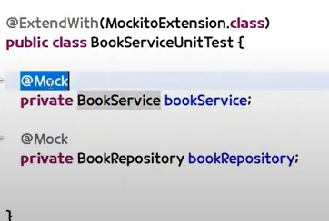

#### @RunWith(SpringRunner.class)
*Junit4의 경우*
실행환경을 스프링으로 확장시키기 위해서는 저 어노테이션을 꼭
붙여줘야함

*Junit5의 경우*
@WebMvcTest 안에 @ExtendWith(SpringRunner.class)이 있어서 저 어노테이션을 안붙여줘도 됨

#### @SpringBootTest(webEnvironment=WebEnvironment.MOCK/RANDOM_PORT)

*webEnvironment=WebEnvironment.MOCK*
실제 톰캣이 아닌 다른 톰캣으로 테스트

*webEnvironment=WebEnvironment.RANDOM_PORT*
실제 톰캣으로 테스트 하는데 다른 포트로

[@SpringBootTest](https://howtodoinjava.com/spring-boot2/testing/springboottest-annotation/)

[공식문서](https://docs.spring.io/spring-boot/docs/1.5.2.RELEASE/reference/html/boot-features-testing.html)
이 문서들 참조하면 도움됨

#### @AutoConfigureMockMvc
- MockMvc를 IoC에 주입해주는 것
*Junit5의 경우*
@WebMvcTest 안에 @AutoConfigureMockMvc이 있어서 저 어노테이션을 안붙여줘도 됨

만약에 @WebMvcTest 안에 없으면 당연히 MockMvc를 빈에 주입해서 써야함.

#### @Transactional
class 위에 붙여서 사용
- org.springframework 거임
##### 각각의 테스트 메소드에서 트랜잭션을 rollback해준다!

#### @ExtendWith(SpringExtension.class/MockitoExtension / 등등)
*단위테스트 할시에*

mockito에서

Service에서 사용할때 repository를 가짜 객체로 만들어서 사용할 수잇음

- repository 위에 @Mock
붙여주면됨

- service는 위에는 @InjectMocks 로 활용
**해당 파일에 @Mock로 등록된 모든 애들을 주입받을 수 있음!!**

#### @DataJpaTest
*단위테스트 할시에*
*Repository들을 메모리에 띄워줌*
*DataMongoTest도 있음*

- 실제 DB 사용
@AutoconfigureTestDatabase(replace=Replace.ANY)

- 가짜 DB 사용
@AutoconfigureTestDatabase(replace=Replace.NONE)

