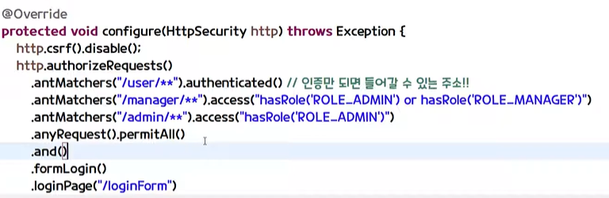

- /login은 기본적으로 security에서 낚아챈다
- securityconfig를 생성한 후에는 작동 안한다
- 권한 설정->securityconfig
    - role
    - .loginPage("/login")으로 하면 권한 없을 때 여기로 이동

- csrf 설정...disable~~ 등등
- 컨트롤러에서 user.setRole()

- 패스워드 암호화
    - BcryptPasswordEncoder

- loginProcessingUrl("주소")
    - 

- loginPage ()  – 사용자 정의 로그인 페이지
- loginProcessingUrl ()
    – 시큐리티가 낚아채서 대신 해당주소로 로그인 진행
    - 사용자 이름과 암호를 제출할 URL
- defaultSuccessUrl () – 성공적인 로그인 후 랜딩 페이지
- failureUrl () – 로그인 실패 후 방문 페이지
- logoutUrl () – 사용자 정의 로그 아웃

- @EnableGlobalMethodSecurity(securedEnabled=true, prePostEnabled=true)
    - securedEnabled config에서 secured 어노테이션 활성화
        ->  controller에서 @secured("ROLE_ADMIN")으로 권한 제어가능
    
    - prePostEnabled=true  preAuthorize 어노테이션 활성화
        -> 컨트롤러에서 메서드 실행되기 직전에 실행됨
    

