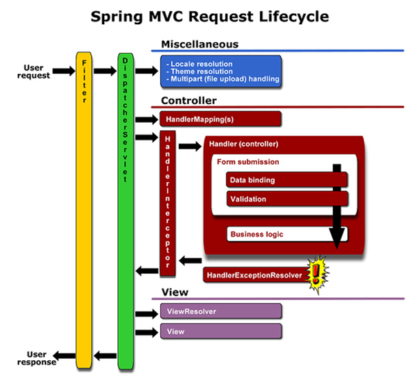
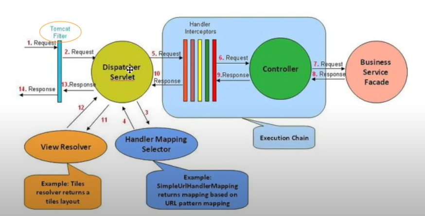

#### 인터셉터
- 컨트롤러에 들어오는 요청 HttpRequest와 컨트롤러가 응답하는 HttpResponse를 가로채는 역할
- 관리자 페이지에 접근하기 전에 관리자 인증을 하는 용도 활용 가능

#### 필터
- Servlet의 앞, 뒤에서 HttpRequest, HttpResponse을 가로챔

#### 인터셉터와 필터의 차이

1. 호출 시점
Filter는 DispatcherServlet이 실행되기 전
Interceptor는 DispatcherServlet이 실행된 후


2. 설정 위치
Filter는 web.xml , Interceptor는 spring-servlet.xml


3. 구현 방식
Filter는 web.xml에서 설정을 하면 구현이 가능하지만, Interceptor는 설정은 물론 메서드 구현이 필요합니다.


#### 환경설정
spring-servlet.xml

```xml
<!-- Interceptors -->

<mvc:interceptors>
         <mvc:interceptor>
                  <mvc:mapping path="/**" /> 
                  <bean class="com.example.interceptor.Interceptor" />
         </mvc:interceptor>
</mvc:interceptors>
```





##### interceptor와 aop의 차이
interceptor
- 타겟이 request와 response
- preHandle, postHandle

aop
- 타겟이 메소드, 파라미터 
- before, after



1. 톰캣 필터가 요청을 받음
2. DispatcherServlet한테 줌
5. DispatcherServlet은 요청을 인터셉터한테줌
6. 컨트롤러한테 전달
7. 서비스


- 
3, 4 핸들러 처리
11, 12 뷰처리


컨트롤러 처리되기 전 preHandle
컨트롤러 처리되고 나서 postHandle


- [인터셉터 유튜브 강의 참조](https://www.youtube.com/watch?v=6rNZFo4eyhE)
- [빅토리 블로그 참조](https://victorydntmd.tistory.com/176)